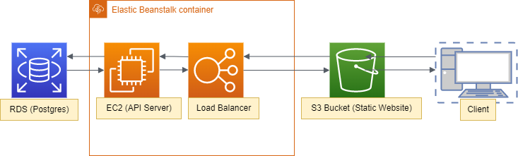
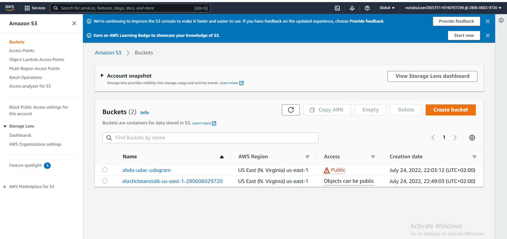
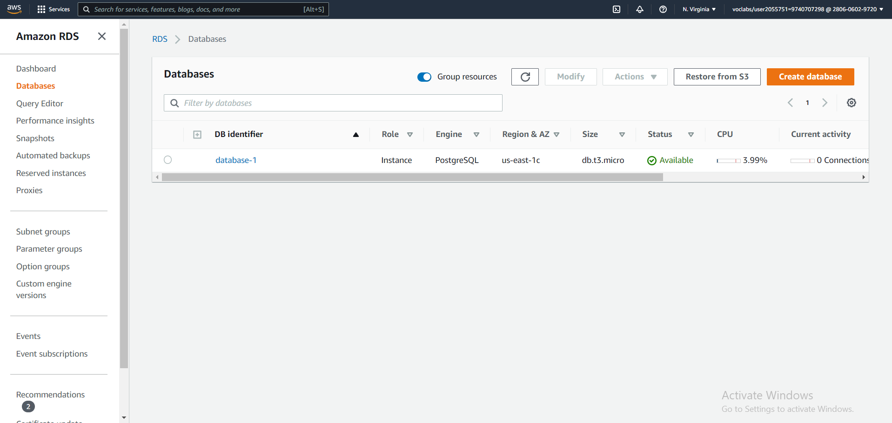
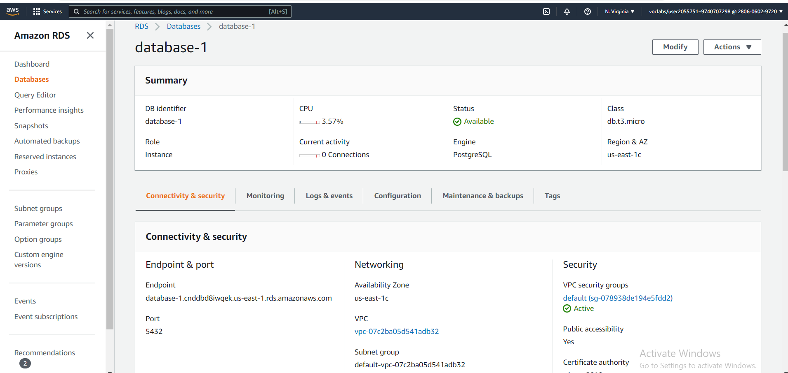
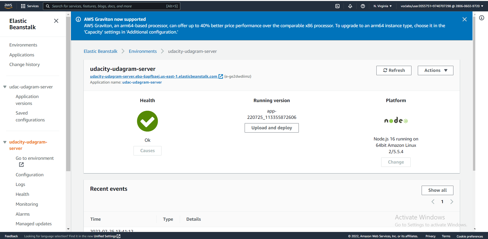
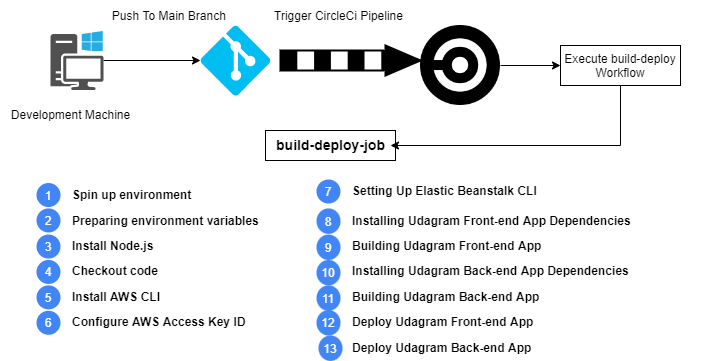
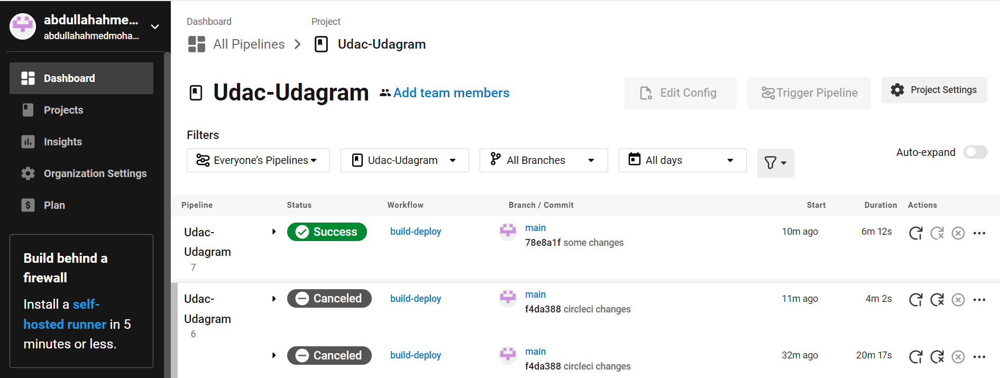
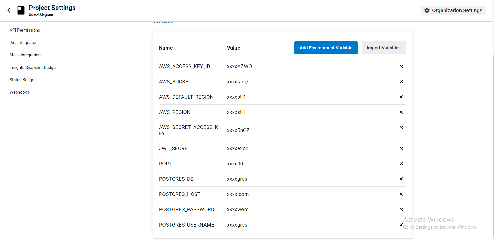
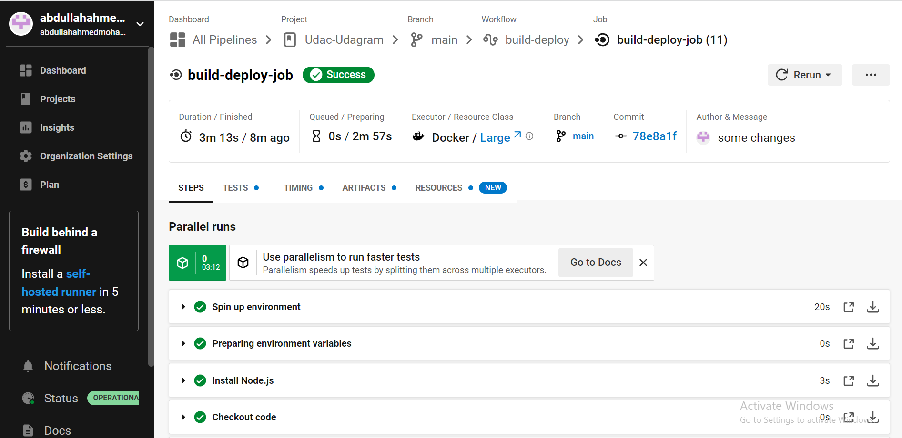
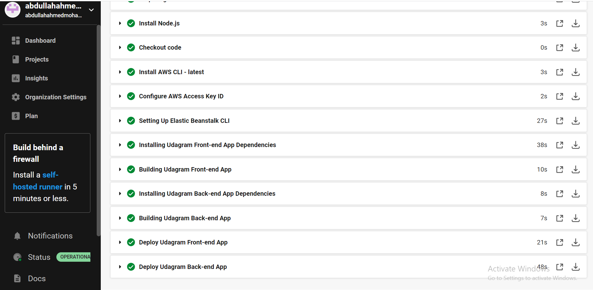

# Continuous Deployment To AWS

this project is prototype project used to deploying it to aws through circleci

### Static Website Link

http://abdo-udac-udagram.s3-website-us-east-1.amazonaws.com/

### Server API Link

http://udacity-udagram-server.eba-6apfbaej.us-east-1.elasticbeanstalk.com/

### Deployment Diagram

### S3 (Static Website)

### RDS Postgres Database

### Elastic Beanstalk (API Server)

#### Elastic Beanstalk Environment Variables

### CircleCi continuous deployment pipeline

#### Pipeline Diagram

#### Pipeline Configuration

