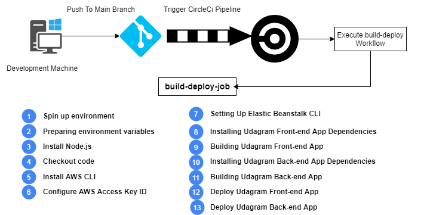
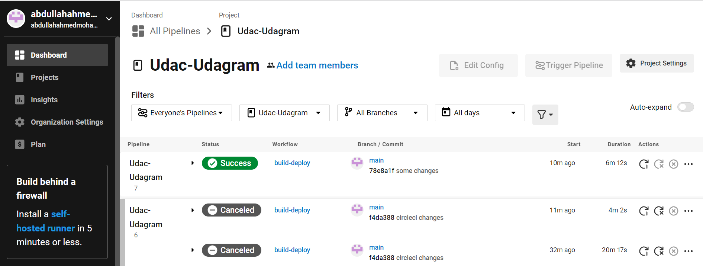
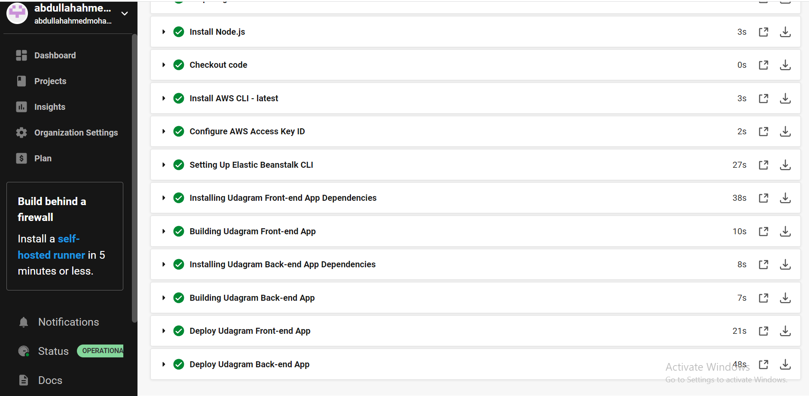

# Pipeline

A continuous deployment (CD) pipeline is a series of steps that must be performed in order to deliver a new version of software. CI/CD pipelines are a practice focused on improving software delivery throughout the software development life cycle via automation.

here i'm using CircleCI Pipeline to automate deployment process on aws cloud

## Pipeline Processes

1. process start when new version is pushed to the main branch at git repository
2. checkout the git repository to download latest application update
3. install all dependencies for front-end and back-end
4. build front-end application
5. deploy front-end application to aws s3 bucket using aws-cli
6. build back-end application
7. deploy back-end application to Elastic Beanstalk environment using eb-cli

## Pipeline Diagram

## CircleCI Configuration

